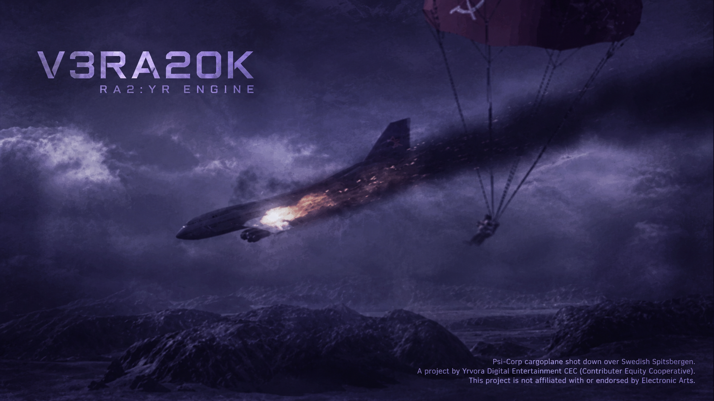

# VERA20K

[](https://discord.gg/kmjRUn5m5F)  [](https://yrvera.github.io/vera20k/)



Red Alert 2: Yuri's Revenge - rebuilt from scratch in Rust for large multiplayer battles.


This project stands on the shoulders of giants. Thanks to OpenRA, XCC Mixer, ModEnc, Project Perfect Mod, EA's open-source Command & Conquer release, World-Altering Editor, FinalAlert 2, YRpp, Ares, Phobos, and many others.

VERA20K operates after contributor-owned cooperative principles. Contributors earn equity shares through contributions or donations. Those shares give automatically income rights and governance weight.

---

## Project Goals

**1.**
A drop-in replacement for `gamemd.exe` focused first on retail-convincing stock
skirmish: experienced Yuri's Revenge players should be able to complete ordinary
matches without repeatedly noticing differences in gameplay, visuals, sound, or
response.

**2.**
Constructed from the ground up for large multiplayer - targeting support for up to **30 players** and **20,000 units** on significantly bigger maps.

**3.**
Offer carefully bounded classic and new RTS features that expand the Command & Conquer: Red Alert 2 experience.

## Current Status

**Early development** - Work is focused on the retail-convincing stock-skirmish path. Progress is reported through observable roadmap outcomes and current tests rather than a hand-maintained completion percentage.


## Requirements

- [Current stable Rust](https://rustup.rs/) (minimum 1.88; selected by `rust-toolchain.toml`)
- A copy of **Red Alert 2: Yuri's Revenge** (the engine reads .mix files from your install)
- Linux: `libasound2-dev` and `libudev-dev`
- Windows: an MSVC Rust toolchain and Visual Studio C++ Build Tools


## Setup

1. Clone the repo:
   ```
   git clone https://github.com/yrvera/vera20k.git
   cd vera20k
   ```

2. Copy the example config and set your RA2 install path:
   ```
   cp config.toml.example config.toml
   ```
   Edit `config.toml` and set `ra2_dir` to where your RA2/YR is installed.

3. Build and run:
   ```
   cargo run --bin vera20k
   ```

## Contributing

Start with the [contributor roadmap](https://yrvera.github.io/vera20k/). It explains where different skills fit, how to choose a bounded contribution, and what evidence and validation each kind of change needs.

1. Fork the repo
2. Create a feature branch (`git checkout -b feature/my-feature`)
3. Make your changes and commit
4. Push to your fork and open a Pull Request

## License

- [GNU General Public License v3.0](LICENSE-GPL)
